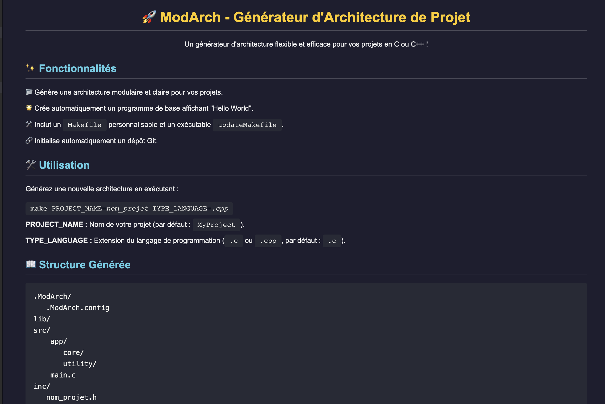
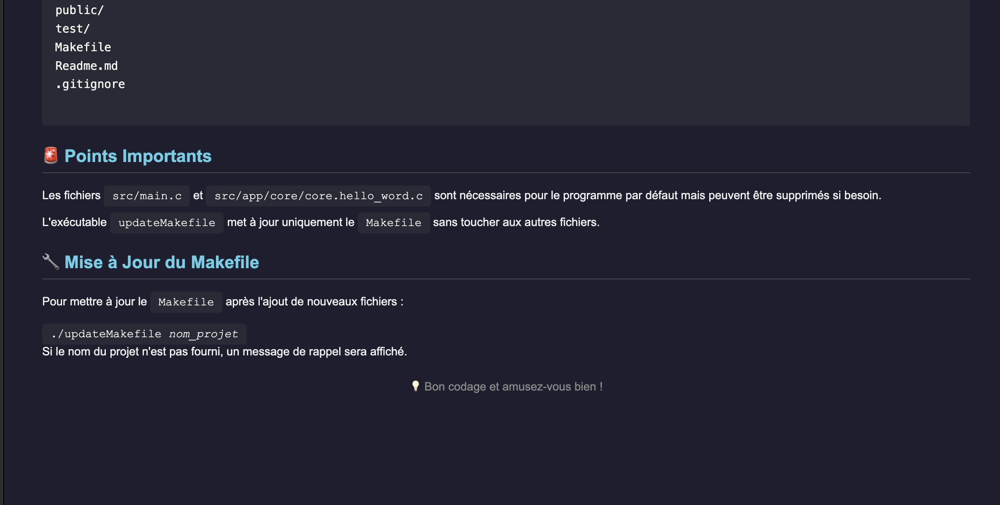

<!DOCTYPE html>
<html lang="fr">
<head>
    <meta charset="UTF-8">
    <meta name="viewport" content="width=device-width, initial-scale=1.0">
</head>
<body>
<section>
   
</section>

<section>
    
</section>
<footer>
    
Créé avec ❤️ par Mamadou Bah (42 Stud) - Sous licence ModArch

</footer>
</body>
</html>
