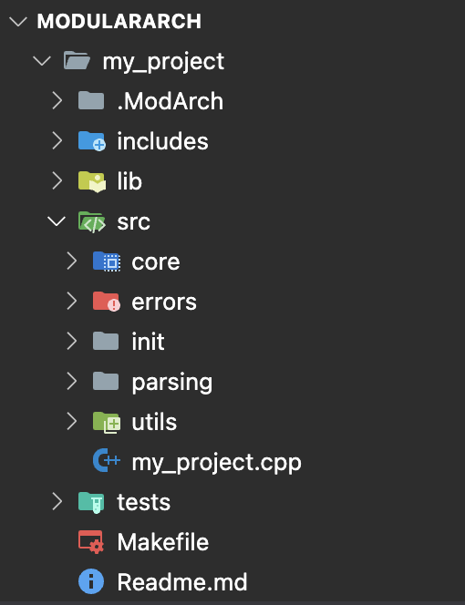
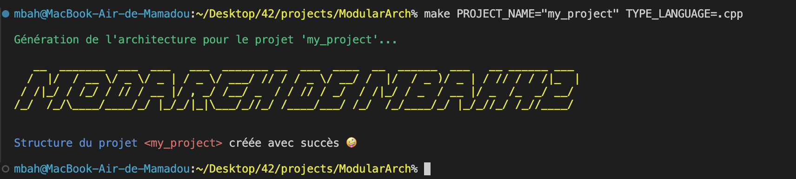
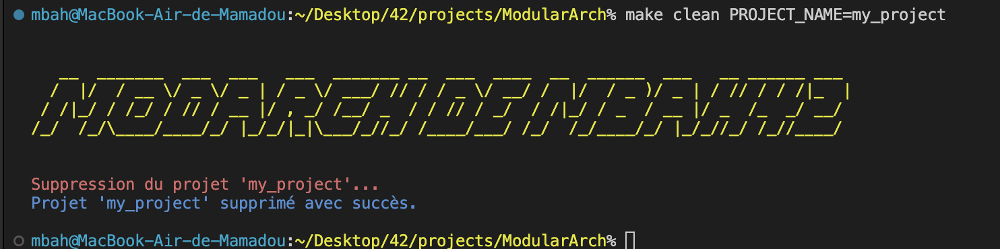
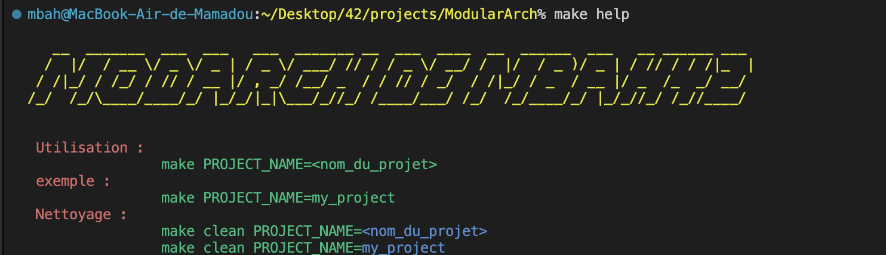

<!DOCTYPE html>
<html lang="fr">
<head>
    <meta charset="UTF-8">
    <meta name="viewport" content="width=device-width, initial-scale=1.0">
    <title>ModArch - Générateur d'Architecture Modulaire</title>
    
</head>
<body>

<header>
    <h1>Bienvenue dans ModArch! 🎉</h1>
    
Le générateur d'architecture modulaire qui fait briller ton projet ! ✨

</header>

<section>
    <h2>Qu'est-ce que ModArch ? 🤔</h2>
    

        ModArch est un générateur d'architecture de projet modulable qui t'aide à créer rapidement une structure
        de projet bien organisée. Avec ModArch, tu n'as plus à t'inquiéter de l'organisation de tes fichiers et répertoires.
        Tu choisis simplement ton nom de projet et ton langage de programmation (ou laisse le par défaut : C) et hop,
        l'architecture est générée pour toi !
    

    
</section>

<section>
    <h2>Comment créer une architecture ? 🚀</h2>
    

        Pour générer une architecture de projet, utilise la commande suivante dans ton terminal :
    

    <pre>
make PROJECT_NAME="my_project" TYPE_LANGUAGE=.cpp
    </pre>
    

        💡 <strong>Note :</strong> Si tu ne spécifies pas de langage de programmation, ModArch utilise le langage <strong>C</strong> par défaut.
    

    
</section>

<section>
    <h2>Comment supprimer l'architecture ? 💥</h2>
    

        Si tu veux supprimer l'architecture générée, utilise la commande suivante :
    

    <pre>
make clean PROJECT_NAME="my_project"
    </pre>
    
</section>

<section>
    <h2>Besoin d'aide ? 🤖</h2>
    

        Tu veux en savoir plus sur les commandes disponibles ? Pas de souci, utilise la commande suivante pour
        obtenir de l'aide !
    

    <pre>
make help
    </pre>
    
</section>

<footer>
    
Créé avec ❤️ par Mamadou Bah (42 Stud) - Sous licence ModArch

</footer>

</body>
</html>
